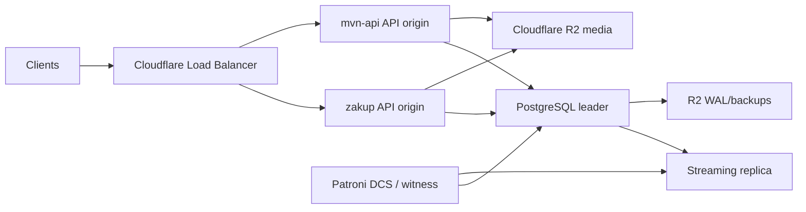

# API HA Runbook

This runbook describes the target high-availability shape for `api.mvn.by`
after the emergency move to `zakup`.

## Current Hosts

| Host | SSH alias | Role today | Recommended HA role |
| --- | --- | --- | --- |
| `zakup` | `zakup` | Current active API origin. Also runs `belzakupki`. | API origin A and initial DB source of truth. |
| Original API VPS | `mvn-api` | Recovered reserve origin. | API origin B and PostgreSQL replica/promote target. |
| Web VPS | `mvn-web` | Storefront/web reserve resources. | Witness only, not a PostgreSQL data node, unless the host is rebuilt into a normal service host. |

Do not run two independent writable PostgreSQL databases. The last incident
already showed why: one host had fresher orders and another host had fresher
payment reconciliation. Cloudflare must not route write traffic to two separate
databases.

## Target Architecture



Rules:

- Exactly one PostgreSQL leader accepts writes.
- API origins are allowed to receive public traffic only when `/api/ready`
  returns HTTP 200.
- `/api/ready` is stricter than `/api/health`: it checks runtime traffic
  controls, DB connectivity, and PostgreSQL writability.
- Scheduler loops and Telegram polling are single-active runtime processes.
  They use PostgreSQL advisory locks when enabled on more than one app origin.
- Product media must not depend on the local disk of one API server. R2 becomes
  the shared media target; local media stays as rollback/fallback until the
  full media migration is complete.

## Recommended Phases

### Phase 1: Code And Load Balancer Readiness

Deploy the backend with:

- `GET /api/ready` for Cloudflare origin health.
- PostgreSQL advisory locks for scheduler startup and Telegram polling.
- Optional deploy smoke variable `API_READY_URL`.

Cloudflare Load Balancer monitor:

```text
Type: HTTPS
Path: /api/ready
Expected status: 200
Method: GET
Interval: 60s
Retries: 2
Timeout: 5s
```

Initial origin settings:

| Origin | Public traffic env | Background env |
| --- | --- | --- |
| Active origin | `APP_ROLE=primary`, `API_READY_ENABLED=true` | `SCHEDULER_ENABLED=true`, `BOT_ENABLED=true` |
| Reserve origin | `APP_ROLE=standby`, `API_READY_ENABLED=false` or unset | `SCHEDULER_ENABLED=false`, `BOT_ENABLED=false` |

During the current transition, if `zakup` must keep serving traffic while bot
and scheduler are intentionally off, set only:

```dotenv
API_READY_ENABLED=true
```

Do not enable `SCHEDULER_ENABLED=true` or `BOT_ENABLED=true` on two origins
while they still use separate local databases.

GitHub deploy variables for an origin that should also verify readiness:

```text
API_READY_URL=http://localhost:18000/api/ready
```

Use `http://localhost:8000/api/ready` on the original API VPS if it is the
active deploy target.

### Phase 2: Media Shared State

Short-term safe state:

- Keep `/opt/.../media` mounted and backed up on each API host.
- Use one-way active-to-standby media refresh only for drills and planned
  promotion.
- Never use bidirectional rsync for product media.

Target state:

- Store new product media variants/original rows in Cloudflare R2.
- Serve public image URLs from `https://cdn.mvn.by/media/...`.
- Keep local media as fallback until all product-facing original fields and
  importer paths have an owner-approved migration path.

R2 is the right shared storage layer because it removes media from API-host
failover. A third VPS with another local copy only moves the same failure mode
around.

### Phase 3: PostgreSQL HA

Recommended implementation for the existing VPS budget:

- PostgreSQL streaming replication from the current source-of-truth DB.
- WAL archiving and base backups to R2 using `pgBackRest` or `WAL-G`.
- Patroni for leader election and promotion.
- A small third witness/DCS node. Use `mvn-web` only if we can safely run and
  monitor the witness service there; otherwise buy a tiny dedicated VPS.

Replication mode:

- Start with asynchronous streaming replication across providers/regions.
  Expected RPO is normally seconds, but not mathematically zero.
- Do not use strict synchronous cross-region replication unless the business
  accepts that writes can block when the standby or network link is unhealthy.
- If true zero data loss is required, prefer a managed HA PostgreSQL provider
  with an SLA over self-managed cross-provider sync.

Initial source of truth:

1. Freeze writes.
2. Confirm `zakup` has the intended current DB state.
3. Take a verified dump and base backup from `zakup`.
4. Rebuild the original API host as replica from that backup.
5. Keep the old independent database stopped or isolated after replica creation.

Failover rule:

- Promote a replica only through Patroni or a documented manual promotion
  command.
- After promotion, make only the promoted origin return 200 from `/api/ready`.
- Do not point Cloudflare at a host whose database is still in recovery or
  read-only.

### Phase 4: Cloudflare Cutover

Use Cloudflare Load Balancing as active-passive first:

- Pool A: current active API origin.
- Pool B: reserve API origin.
- Monitor path: `/api/ready`.
- Session affinity: off unless a future stateful API feature requires it.

Manual failover checklist:

1. Confirm backups/WAL are current.
2. Stop bot/scheduler on the old active origin or set:

   ```dotenv
   SCHEDULER_ENABLED=false
   BOT_ENABLED=false
   API_READY_ENABLED=false
   ```

3. Promote PostgreSQL on the reserve side.
4. Set the promoted API origin:

   ```dotenv
   APP_ROLE=primary
   API_READY_ENABLED=true
   SCHEDULER_ENABLED=true
   BOT_ENABLED=true
   ```

5. Recreate `app` and `bot`.
6. Verify locally:

   ```bash
   curl -fsS http://127.0.0.1:8000/api/ready
   curl -fsS http://127.0.0.1:8000/api/health
   curl -fsS 'http://127.0.0.1:8000/api/v1/products?limit=5'
   ```

7. Confirm Cloudflare marks the origin healthy.
8. Confirm public:

   ```bash
   curl -fsS https://api.mvn.by/api/ready
   curl -fsS https://api.mvn.by/api/health
   curl -fsS 'https://api.mvn.by/api/v1/products?limit=5'
   ```

## What Not To Do

- Do not use Cloudflare LB health on `/api/health` for failover. It can be
  healthy while the origin must not receive writes.
- Do not run two local writable databases and try to reconcile them later.
- Do not make `mvn-web` a full Postgres data node just because it has spare CPU
  and disk. It is a web/cPanel-style host today; using it as a witness is much
  safer than storing primary data there.
- Do not delete local media after enabling R2 until product originals and
  importer paths are covered.

## Cloudflare Access Needed For Automation

Manual dashboard changes are enough. If Codex/GitHub should manage Cloudflare
directly, create a scoped token for the `mvn.by` zone with:

- DNS edit/read.
- Load Balancing edit/read.

Do not grant account-wide admin unless a specific operation requires it.
