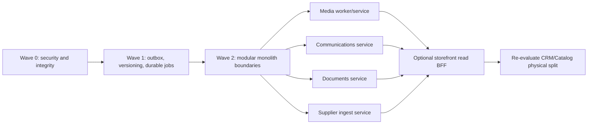

# Дорожная карта разделения MVN на самостоятельные сервисы

Этот документ описывает целевые границы. Детальный evidence и реестр рисков находятся в `docs/global-system-audit-2026-07-12.md`.

## Архитектурное решение

Сначала modular monolith, затем extraction. Storefront и Telegram process уже можно разворачивать отдельно, но это ещё не самостоятельные domain services: они используют общую backend-модель и не имеют устойчивых command/event contracts.

Wave 0 закрыта, слита через PR #726 и развернута в production как SHA `886593e0`: единый CI дал **1177 passed**, migration/codegen gates, Patroni primary/replica deploy и storefront canary/VPS/Cloudflare smoke прошли. Декомпозиция этим не завершена. Outbox producer switch/consumer, optimistic concurrency, canonical customer identity, private media, lean DTO, dependency upgrades и общий durable job framework остаются открыты. Первая Wave 1 итерация добавляет только выключенный additive outbox/inbox/delivery foundation без изменения production notification path.

## Целевые bounded contexts

### CRM Core

Владеет customer identity, branches, leads, orders, proposals, order lines, payments, stages и assignments. Это одна транзакционная граница до появления доказанной необходимости разделить её.

Публичные contracts:

- commands с actor/idempotency/expected version;
- slim projections для lists/boards;
- versioned domain events через outbox.
- отдельный `CreatePublicLead` command: canonical phone/email, dedupe window, idempotency key и source/consent metadata; edge+app rate limit и risk-based anti-bot остаются обязательным gateway policy, а не логикой формы.

### Catalog Core

Владеет products, brands, series, tags, specs, publication и catalog revision. Supplier raw data не пишет product tables напрямую: он формирует import proposal/job, который применяет Catalog.

Публичные contracts:

- `CatalogCard`, `ProductDetail`, `BuildManifest`, `FilterConfig`;
- publication/revision events;
- batch supply metrics contract без N+1.

### Media

Владеет original objects, variants, processing jobs, privacy class, references и retention. Domain services хранят media asset ID, но не физический path/public URL.

Можно выделять первым после:

- atomic lease claim;
- signed/private access;
- idempotent processing;
- reference API и delete policy.

Atomic claim, lease token и heartbeat уже реализованы в рабочем diff, но остальные условия extraction ещё открыты. До их закрытия это усиленный worker текущего модульного монолита, а не самостоятельный Media service.

#### Обязательный rollout media worker

Новый API требует lease token в renew/complete/fail, поэтому старый worker с ним несовместим. Mixed versions запрещены.

1. **Stop/drain:** остановить polling/claim старых workers, дать активным jobs закончиться и подтвердить отсутствие `running` jobs.
2. **Migrate/deploy API:** выполнить additive migration `lease_token`, развернуть новый API и пройти health/smoke checks, не возобновляя workers.
3. **Deploy workers:** обновить все worker instances до версии с token ownership и heartbeat.
4. **Resume:** запустить один worker, проверить тестовую job, duplicate-claim/lease metrics и только затем вернуть штатную concurrency.

Rollback выполняется в обратном безопасном порядке: снова остановить workers; завершить активные jobs новой совместимой парой либо дождаться expiry/requeue; откатить API и workers вместе; только затем resume. Additive колонку не удалять и migration не downgrade'ить во время инцидента. Старую пару нельзя включать, пока остаются tokenized `running` jobs. При сбое до resume очередь остаётся остановленной до восстановления API/БД по release runbook.

### Communications

Владеет templates, channel routing, deliveries, retry/DLQ и provider diagnostics. Producers не вызывают Telegram/SMTP напрямую; они пишут domain event/outbox.

Можно выделять после стабилизации in-process worker: перенос worker не меняет producer contract.

### Documents

Владеет generation jobs, templates snapshot, Drive/provider object mapping, delivery artifacts и reconciliation. CRM хранит document business reference/status, но не управляет Google SDK.

### Supplier Ingest

Владеет raw files/fetches, parsers, source snapshots, mappings и import proposals. Apply в Catalog идёт через versioned command с idempotency.

Procurement/supply requests пока остаются рядом с CRM/order line snapshots: их нельзя безболезненно вынести, пока они зависят от mutable order state.

### Identity & Access

На первом этапе это общий package/contract, не отдельный network service:

- immutable actor ID;
- roles/capabilities;
- session/re-auth/revocation;
- audit events.

Выделять отдельно имеет смысл, когда несколько самостоятельных deployables действительно нуждаются в общей identity plane.

### Operations Control Plane

Backup/restore, migrations, failover и maintenance — не manager business API. Это отдельный административный контур с owner approval, fencing, traffic coordination, durable audit и runbook.

## Общая инфраструктура контрактов

### Event envelope

```text
event_id
event_type
schema_version
aggregate_type
aggregate_id
aggregate_version
occurred_at
actor_id
correlation_id
causation_id
idempotency_key
payload
```

### Command envelope

```text
command_id
command_type
schema_version
actor_id
permissions
aggregate_id
expected_version
idempotency_key
correlation_id
payload
```

### Правила

1. Только владелец context пишет его таблицы.
2. Между contexts нет distributed transaction; используется outbox/inbox и reconciliation.
3. Consumer uniqueness основана на event/command ID, а не на времени.
4. Contract backward compatibility проверяется CI.
5. PII classification и retention являются частью schema, а не устной договорённостью.
6. Любой внешний provider вызов выполняется worker'ом после durable state transition.

## Порядок extraction



Wave 0 на этой диаграмме развернута. В Wave 1 отдельно входят public lead abuse/dedupe/rate-limit contract, checkout idempotency/canonical identity, order versioning, переключение producers/consumer на outbox и durable operations. Media worker в production пока отсутствует и остаётся выключен; extraction нельзя начинать только на основании уже реализованного lease claim.

## Anti-goals

- Не создавать сервис на каждый router или frontend.
- Не давать новому сервису прямой write-access к общей БД.
- Не заменять транзакцию цепочкой синхронных HTTP вызовов.
- Не выносить `OrderService` целиком до разделения его use cases.
- Не переносить process-local queues/locks как есть.
- Не вводить Kafka/сложную orchestration platform до доказанного объёма; PostgreSQL outbox/job queue достаточен для первого этапа.

## Метрики готовности

- delivery success/retry/terminal failure и oldest outbox age;
- job claim latency, lease expiry/recovery, duplicate claim count;
- checkout/order command latency и idempotency hit rate;
- optimistic conflict rate по aggregate/use case;
- catalog list payload/TTFB/cache hit rate;
- media processing duration/failure/storage growth;
- provider latency/error rate;
- migration duration/failure и release rollback time.

Решение о каждом следующем extraction принимается по этим метрикам и operational ownership, а не по размеру репозитория.
